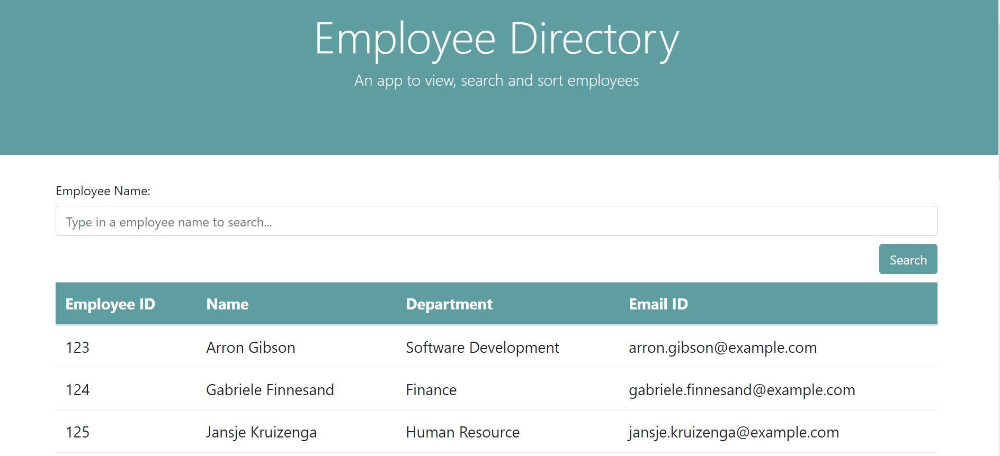

# Employee Directory

## Description
Employee directory is an app to list all employees and search and sort them. It is built primarily using React and bootstrap. The application is currently hosted as github page and url is given in relevant [section](#URL)
## Table of Contents
* [Installation](#installation)
* [Usage](#usage)
* [License](#license)
* [Contributing](#contributing)
* [Screenshot](#screenshot)
* [URL](#url)
* [Questions](#questions)
## Installation
Please download repository and run npm install and configure employee data in [employees.json](./src/utils/employees.json)
## Usage
The user should be able to:
  * Sort the table by any column.
  * filter the employee by employee name.
## Contributing
You are most welcome to contribute. There are following ways to contribute:
1. Please raise a pull request.
2. Please raise a new feature request.
3. Please raise a new issue.
All requests will be reviewed and processed accordingly.
## Screenshot

## URL
https://nitinmuk.github.io/employee-directory/
## License
This application is covered by [MIT](./LICENSE) license
## Questions
* Please raise a request at [github](https://github.com/nitinmuk)
* For any private question/enquiry, please reach out to my email: nitinmukes@gmail.com